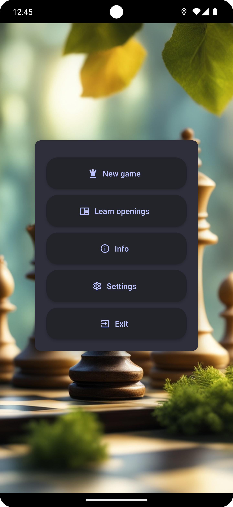
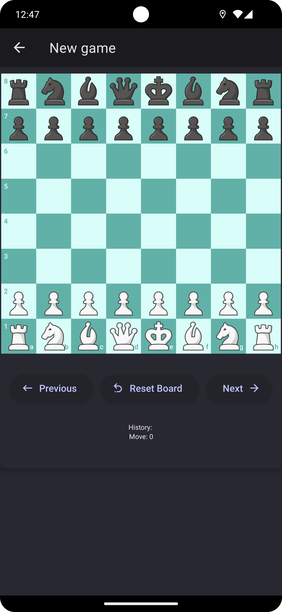
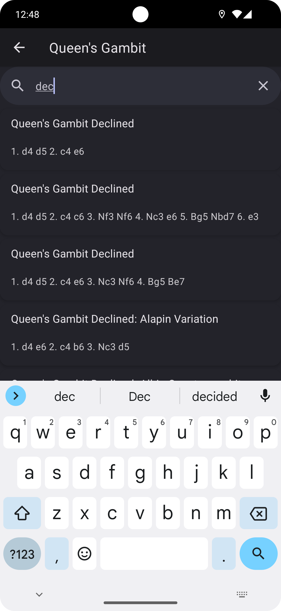

# ChessPal

ChessPal is a mobile application built with React Native. It provides a platform for users to learn and play chess.

## Interface

Here are some screenshots of the app:

<p float="left">
  
   
  
</p>

## Installation 

Clone the repository and install the dependencies.

```bash
git clone https://github.com/kridesav/ChessPal.git
cd ChessPal
npm install
```

## Using the application

For running on a simulator on pc:

```bash
npx expo start
```
or alternatively using expo app on your phone:

```bash
npx expo start --tunnel
```

and launch with QR-code from the terminal.

## Features

Chesspal is designed for learning opening theory in chess, it has large dataset of openings that you can search
and try.

Chesspal also lets you theorycraft in a fresh game on your own, currently there isnt a chess engine implemented but
in the future it is planned, so you can test your freshly learned theory against different difficulty bots.

Chesspal has very user-friendly interface and it is easy to approach.

## Dependencies

- [@react-navigation/native](https://www.npmjs.com/package/@react-navigation/native): ^6.1.17
- [@react-navigation/native-stack](https://www.npmjs.com/package/@react-navigation/native-stack): ^6.9.26
- [@rneui/base](https://www.npmjs.com/package/@rneui/base): ^4.0.0-rc.7
- [@rneui/themed](https://www.npmjs.com/package/@rneui/themed): ^4.0.0-rc.8
- [chess.js](https://www.npmjs.com/package/chess.js): ^1.0.0-beta.8
- [expo](https://www.npmjs.com/package/expo): ~50.0.14
- [expo-status-bar](https://www.npmjs.com/package/expo-status-bar): ~1.11.1
- [react](https://www.npmjs.com/package/react): 18.2.0
- [react-native](https://www.npmjs.com/package/react-native): 0.73.6
- [react-native-chessboard](https://www.npmjs.com/package/react-native-chessboard): ^0.1.2
- [react-native-gesture-handler](https://www.npmjs.com/package/react-native-gesture-handler): ~2.14.0
- [react-native-paper](https://www.npmjs.com/package/react-native-paper): ^5.12.3
- [react-native-reanimated](https://www.npmjs.com/package/react-native-reanimated): ~3.6.2
- [react-native-safe-area-context](https://www.npmjs.com/package/react-native-safe-area-context): ^4.8.2
- [react-native-screens](https://www.npmjs.com/package/react-native-screens): ~3.29.0

## Author

Kristjan Savolainen - [Github](https://github.com/kridesav)

## License

This project is licensed under the MIT License - see the [LICENSE](LICENSE) file for details

